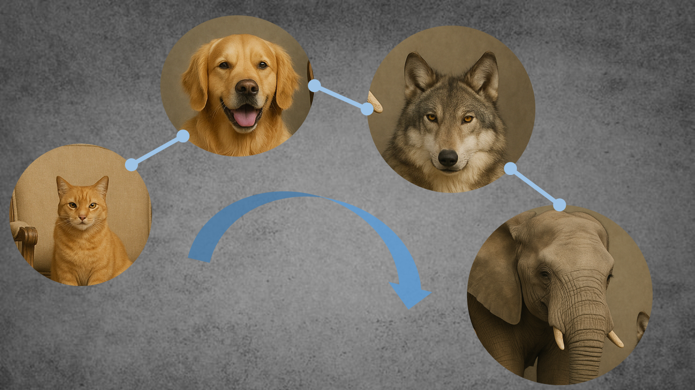

# Semantic Depth Matters: Explaining Errors of Deep Vision Networks through Perceived Class Similarities

**DeepHierarchy** is a repository with code that can be used to analyze deep neural networks trained for classification to see how they structure their class spaces. We use graphs to facilitate analysis. Our framework can be used for the purpose of analyzing deep neural network misclassifications by linking them to the semantic hierarchies encoded in the model. These encoded hierarchies can be extarcted with no data samples! Using the proposed **Similarity Depth (SD)** metric and **graph-based visualizations**, we showed in our paper that higher semantic depth (based on WordNet lexical tree) improves the alignment between perceived class similarities and actual errors, offering insights beyond accuracy alone. The majority of our methods do not require any images for testing! **Networks that reasonable structure the known class space --> Reliable, reasonably working and explainable neural networks!**

### Check out our paper for more details!

> Filus, Katarzyna, Michał Romaszewski, and Mateusz Żarski. "Semantic depth matters: Explaining errors of deep vision networks through perceived class similarities." arXiv preprint arXiv:2504.09956 (2025).

## Usage

Here's how to use this tool

1. Prepare your models outputs and put them into `Models_CSM` directory in a structure: `Models_CSM/<<model_name>>/`. Required items are: `binary_matrices.pkl`, `binary_matrices_after_epoch_confusion_CCSM.pkl`, `binary_matrices_after_epoch_weights_NCSM.pkl` and `results.yml`.
2. Make sure your `WordNet_data` contains items: `Native.pkl`, `WUP.pkl` and `wordnet_classes.yml`. They are provided with this repository, but check just in case.
3. Prepare your config file and put it into `configs` directory.

Or use `default.yml` and specify within:

- `WN_PATH` -- path to WordNet data
- `MODEL_PATH` -- path to your model data (in both cases you can specify another directory that is not default to this project)
- `CHECK_EPOCH` -- specify the number of epoch you want to check the communities for (by default it is epoch 200, but you can see the communities forming across any epoch you pick)
- `SEED` -- specify random seed for graph generation (or leave it at 42)

4. Run program with `python3 main.py` if you want to use `default` config or `python3 main.py config_name` if you want to use `config_name` for the input parameters.
5. You'll get the results in `results` directory in a form:

- `MAIN_DIR` with the name corresponding to the time of running the program
- `MAIN_DIR/results_epoch_num.csv` with overall results for every model specified for given epoch.
- `MAIN_DIR/DF` with `results.csv` for every model, epoch specified, and both NCSM and CCSM similarity measurements.
- `MAIN_DIR/PLOTS` with `.png` plot of every community, for every model, epoch specified, and both NCSM and CCSM similarity measurements.
- `MAIN_DIR/DIR_COMP` and `MAIN_DIR/EXT_COMP` for compliance graphs for both direct and extended neighborhoods.

Also be sure to watch the terminal output, as it also gives out results in a straightforward way.

## Citation

If you find this work useful or use the methods, please cite our arxiv paper:

> @article{filus2025semantic,
  title={Semantic depth matters: Explaining errors of deep vision networks through perceived class similarities},
  author={Filus, Katarzyna and Romaszewski, Micha{\l} and {\.Z}arski, Mateusz},
  journal={arXiv preprint arXiv:2504.09956},
  year={2025}
}
